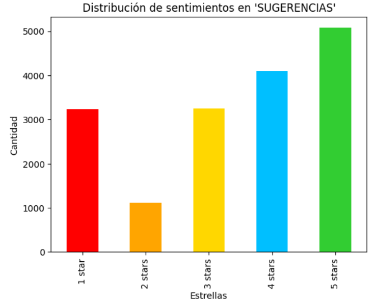
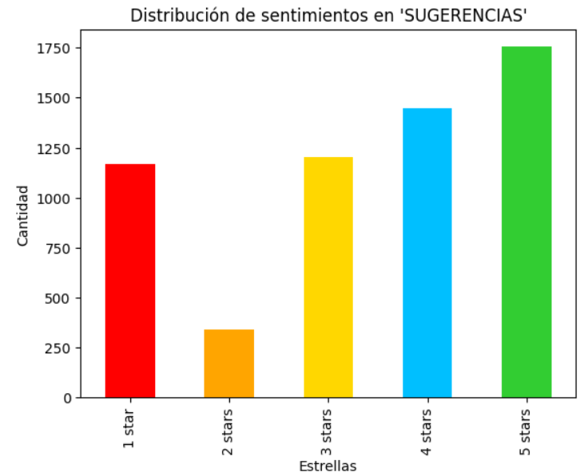
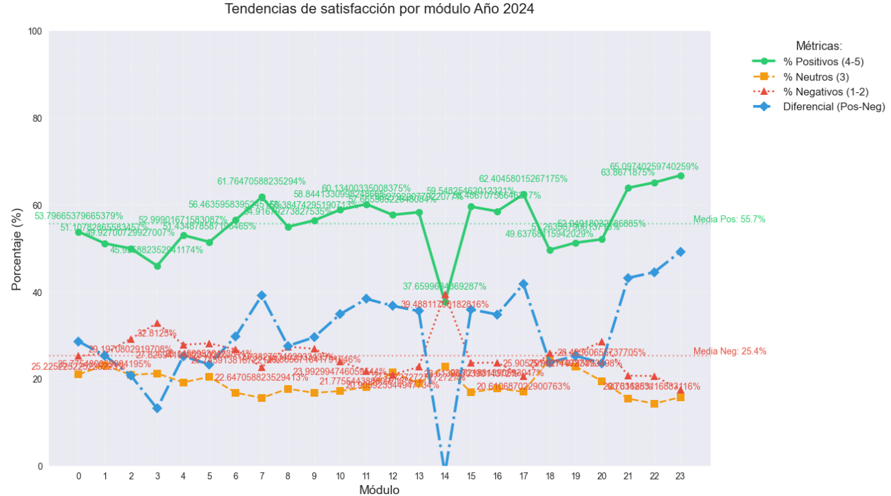

# Análisis de sentimiento y tópicos en comentarios de estudiantes (Prepa en Línea, 2024-2025)  

## 🔍 Resumen  
Proyecto de **Procesamiento de Lenguaje Natural (NLP)** que analiza comentarios de estudiantes hacia asesores virtuales de *Prepa en Línea* (datos 2024-2025). Mediante **BERT** (fine-tuning para español) y técnicas de modelado de tópicos, se identifican:  
- **Patrones de sentimiento** (clasificación binaria y multiclase).  
- **Temas críticos** (ej: claridad de materiales, comunicación con asesores).  
- **Recomendaciones basadas en datos** para la mejora pedagógica.  

## 🛠️ Tecnologías Clave  
- **Librerías NLP**: `transformers` (BERT), `spaCy` (procesamiento textual), `gensim` (LDA).  
- **Analítica**: Pandas, NumPy, Scikit-learn.  
- **Visualización**: Plotly (gráficos interactivos), WordCloud.  
- **Infraestructura**: Jupyter Notebooks, Google Colab (GPU para fine-tuning de BERT).  

## Procesamiento del texto

### Funciones clave:
limpiar_espacios()      # Normaliza espacios múltiples  
eliminar_puntuacion()   # Elimina signos de puntuación  
eliminar_stopwords()    # Filtra stopwords personalizadas (ej: "de", "que", "la")  

### Transformaciones aplicadas:
1. Lowercasing  
2. Reemplazo de guiones  
3. Eliminación de espacios redundantes  
4. Limpieza de puntuación  
5. Filtrado de 50+ stopwords en español  

## 📊 Métricas y Hallazgos

### 1. Distribución de Sentimientos (2024 vs 2025)
  
  
*Clasificación por estrellas: 1★ (negativo), 3★ (neutro), 5★ (positivo)*

---

### 2. Análisis por Módulo (2024)


**Hallazgos clave:**  
✅ **Módulos destacados** (2024):  
- Módulos 23, 22, 21 y 17 con >62% positivos (vs promedio 55.7%)  
- Diferenciales de +41 a +49 puntos (positivos - negativos)  

⚠️ **Módulos críticos**:  
- Módulo 14: Solo 37.7% positivos y -1.8 diferencial  
- Módulo 3: 46% positivos (13.1 diferencial)  

📈 **Tendencias**:  
- Comentarios positivos aumentan en módulos finales  
- Neutros estables (19% promedio)  

---

### 3. Análisis por Módulo (2025)


**Hallazgos clave:**  
✅ **Módulos destacados** (2025):  
- Módulos 23 (69% positivos), 22 (66.5%) y 18 (42.6%)  
- Diferenciales récord (hasta +52 puntos)  

⚠️ **Módulos críticos**:  
- Módulo 14: 42% positivos (9.4 diferencial)  

📈 **Tendencias**:  
- Mayor dispersión: mejores máximos pero peores mínimos vs 2024  
- Relación inversa clara: ↑positivos ⇄ ↓negativos  

---

### 🔍 Conclusiones Comparativas  
- **Mejora en tops**: Módulo 23 pasó de 66.7% (2024) a 69% (2025)  
- **Persistencia de problemas**: Módulo 14 sigue siendo crítico en ambos años  
- **Estabilidad**: Comentarios neutros se mantienen ~15-25%  
- **Oportunidad**: 11 módulos superan el promedio (55.7% en 2024, 54.4% en 2025)
  

## 🎯 Impacto  
- **Decisiones pedagógicas**: Priorización de módulos con mayor insatisfacción.  
- **Gestión educativa**: Diseño de talleres para asesores basados en feedback negativo.  

## 📂 Estructura del Repositorio  

```python

data/
    ├── raw/                # Comentarios crudos (CSV)
    ├── processed/          # Datos unidos y limpios
notebooks/
    ├── Analisis tematico con limpieza antes (bueno).ipynb  # Realiza el analisis de sentimiento con BERT
    ├── Analitica comentarios AV 2024.ipynb  # Realiza la limpieza del texto, bigramas y trigramas de los datos del 2024.
    ├── Analitica comentarios AV 2025.ipynb  # Realiza la limpieza del texto, bigramas y trigramas de los datos del 2025.
images/                      # Contiene las imagenes del readme
Top-10-de-palabras-y-nube-de-palabras-(felicitaciones)/   # Contiene el top 10 de palabras por modulo nube de palabras
Top-10-de-palabras-y-nube-de-palabras-(sugerencias)/   # Contiene el top 10 de palabras por modulo nube de palabras

```

## 📌 Cómo Replicar el Análisis

1. Instalar dependencias: `pip install -r requirements.txt`.  
2. Ejecutar notebooks en orden numérico.  
3. Para fine-tuning de BERT: Usar GPU (Google Colab recomendado).  

---
